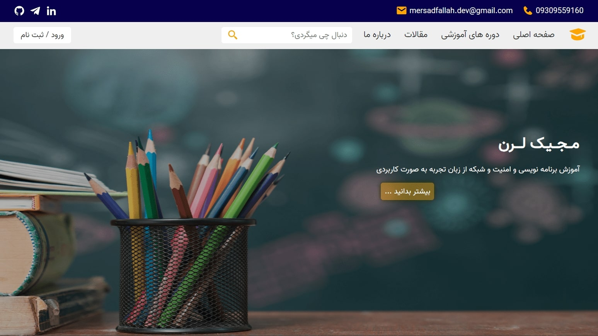

# Magic-Learn
This is my first responsive project with HTML, CSS and a little JavaScript In this educational project, I tried to implement my learning in the best way and the focus was on the main page.
In this project, I tried to limit myself to how much I can use CSS tricks instead of JavaScript.

It is interesting to know that for this project, I have created my own style grid system and responsive design to challenge my responsive design skills without the need for flexbox or cssgrid or any framework.😍

## Demo

✅ Responsive Demo :

## How ro use
for start this project just need to start index.html file in your live server.

---
I hope you like my first project.❤️
Make me happy by giving this project a star ✨
